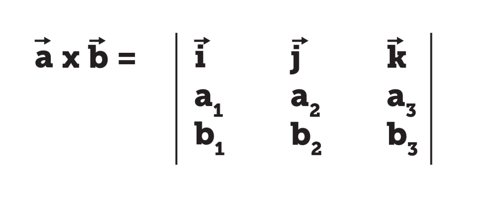
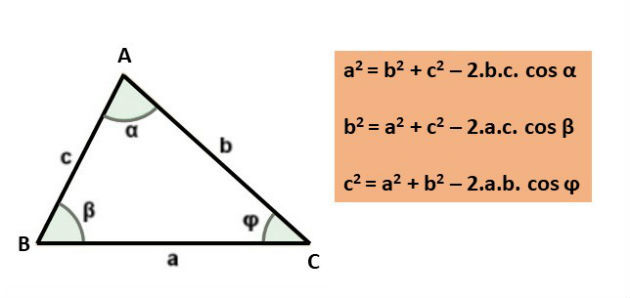
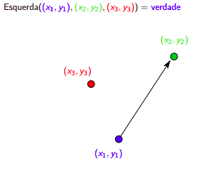
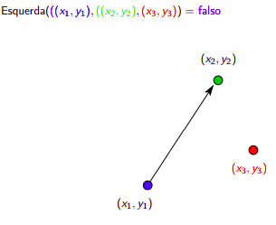
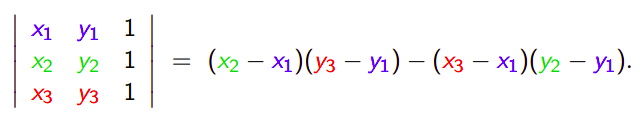

# Introdução a geometria para programação competitiva

## Aula 11 - BixeCamp

Nessa ultima aula do BixeCamp vamos conversar sobre geometria, em especial, os tópicos de geometria mais recorrentes em maratonas de programação. Além disso, noções de geometria analítica e solida são muito bem vindas.

Os tópicos que vamos abordar serão os seguintes:

- Noção de precisão com **double**
- Como **representar ponto, reta e polígono**
- **Produto interno** (dot/inner) e **produto vetorial** (cross/externo)
- Relembrando algumas **formulas** de ponto e reta
- Calculando a **area de um polígono** qualquer
- **Teste de esquerda** (uma das primitivas mais uteis)
- Checar se **ponto esta dentro de um polígono** convexo

Para quem deseja se aprofundar um pouco mais em geometria depois desta aula, acredito que dois excelentes tópicos são **convex hull** (fecho convexo) e **line sweep** (linha de varredura), sendo que este ultimo possui um [excelente video no nosso canal do youtube](https://www.youtube.com/watch?v=3ph6V32oja0).

## Noções de precisão com double

A principal maneira de representarmos números com casas decimais é utilizando o tipo ```double```. Porém, a representação com ponto flutuante (_double_ vem de _dupla precisão no ponto flutuante_) **não é precisa**. Vamos olhar o código abaixo:

```cpp
double x = 0.3
cout << x << endl;
```

O resultado de nosso programa será `0.3`, isso acontece pois estamos arredondando a saida para a 6ª casa decimal, essa é a precisão padrão do `cout` do C++. Ou seja, o numero `1.123456789` seria arredondado para `1.123457`. 

Agora, vamos imprimir mais casas decimais. Isso pode ser feito com o método `setprecision()` da _std_, além disso, se quisermos forçar que as casas decimais sempre sejam impressas, podemos usar `fixed`, com isso, temos o seguinte código que imprime com a precisão de 30 casas decimais:

```cpp
double x = 0.3
cout << setprecision(30) << fixed << x << endl;
```

Agora, o resultado do nosso programa é `0.299999999999999988897769753748`. Como podemos ver, o numero não é representado como exatamente `0.3`.

Mas afinal de contas, que tipo de problema isto pode nos causar? O principal deles é não podermos realizar comparações diretas da forma `x == 0.0` ou `x == y`, pois seria muito difícil que tais comparações sejam corretas.

Para contornar essa limitação, usamos **epsilons**, números muito pequenos que nos ajudam com esse tipo de comparação. Vamos olhar o código abaixo:

```cpp
const double EPS = 0.000000001; // definindo epsilon com 10^(-9)
double x = 1.0, y = 4.20;

if (x == 0.0)       // jeito errado
if (abs(x) < EPS)   // jeito ceto

if (x == y)         // jeito errado
if (abs(x-y) < EPS) // jeito certo
```

Existem muitas outras maneiras e formas de trabalhar com o epsilon, mas todas são parecidas com o que temos aqui. Além disso, aqui, estamos fixando uma precisão de 9 casas decimais para trabalhar, e isso pode mudar de acordo com o problema.

Assim como `int` e `long long int`, também possuímos diferentes sabores de `double`, são eles:

- `float`: 32 bits de precisão, **não usem**.
- `double`: 64 bits de precisão, **usado 99% das vezes**.
- `long double`: 128 bits, preciso pra cara&#o, mas não é muito eficiente, use somente quando muita precisão é necessária.

Aqui, temos algumas funções uteis da _std_:

- `floor()`, retorna o piso de uma valor decimal, assim `floor(3.4)` retornaria `3`.
- `ceil()`, retorna o teto de uma valor decimal, assim `ceil(3.4)` retornaria `4`.
- `trunc()`, retira a representação decimal, assim `trunc(3.4)` retornaria `3`.
- `const double pi = acos(-1)`, retorna o valor de pi.

Por ultimo, temos uma observação importante: sempre que der, **evite usar double**, tente sempre trabalhar com inteiros, e só use a representação decimal quando de fato necessária.

### Referencias sobre essa parte

- [Explicação sobre pontos flutuantes](https://www.ime.usp.br/~leo/mac2166/2017-1/introducao_float)
- [Um pouco mais sobre tipos em C++](https://en.cppreference.com/w/cpp/language/types)

## Representação ponto, reta e polígono

Se vocês visitarem sites como o _cp-algorithms_ vão achar estruturas muito completas e robustas para representar pontos e retas. Porém, essas implementações são muito longas e acabam atrapalhando quando estamos fazendo uma prova. Por isso, vou apresentar a **maneira simples** que uso para representar um ponto.

```cpp
#define x first
#define y second
typedef pair<int, int> point;
```

Com isso, conseguimos criar, ordenar e atualizar nossos pontos de maneira muito fácil. Além disso, se eu quiser outro tipo de dados para armazenar o menos, basta eu alterar os tipos associados ao par no _typedef_.

Da mesma maneira, podemos representar uma reta da forma `y = ax + b`. Como veremos mais a frente, as vezes é interessante que guardemos o coeficiente `a` na sua forma de fração, isto é, `a = a_num/a_den`, se quisermos armazenar a reta dessa maneira poderíamos fazer como abaixo:

```cpp
#define a_num first.first
#define a_den first.second
#define b second
typedef pair< pair<int, int>, int> line;
```

Finalmente, podemos representar um polígono muito facilmente usando o `vector` da _std_, de tal forma que teremos um vetor de pontos, com isso, basta:

```cpp
// definindo um poligono
typedef vector<point> polygon;

// instanciando um novo poligono e inserindo um ponto
polygon p;
p.push_back({1,1});
```

Vale notar, que, na maioria dos problemas, a ordem que os pontos são passados para esse vetor corresponde a uma travessia anti-horaria pela fronteira do polígono.

## Produto interno (dot/inner) e produto vetorial (cross/externo)

Primeiramente, sobre o **produto interno**. Seja `a` e `b` vetores tal que `a = (a1, a2)` e `b = (b1, b2)`, definimos o produto interno entre `a` e `b` como `a.b = (a1*b1) + (a2*b2)`. Além disso, temos uma igualdade muito importante, `a.b = |a|*|b|*cos(theta)`, onde `|a| = sqrt(a1*a1 + a2*a2)` é o comprimento de `a`.

<center>  </center>

Com isso conseguimos obter o angulo entre dois vetores com a operação `theta = acos(a.b / |a|*|b|)`. Note que, se quisermos o obter o angulo a partir da origem, podemos tomar os vetores `a` e `b` como pontos. Além disso, se quisermos obter o angulo com relação a um ponto `c`, podemos fixar esse ponto como a origem, fazendo `a = a-c = (a1-c2, s2-c2)` e `b = b-c`.

Com isso, podemos escrever as seguintes funções:

```cpp
#define x first
#define y second
typedef pair<int, int> point;

// produto interno dos pontos a e b
int dot(point a, point b) {
    return a.x*b.x + a.y*b.y;
}

// norma de a
int norm(point a) {
    return dot(a, a);
}

// comprimento de a
double length(point a) {
    return sqrt(norm(a));
}

// retorna o angulo entre a e b em radianos
// retorna double pois é um angulo
double angle(point a, point b) {
    return acos( dot(a,b) / (length(a)*length(b)) );
}

// angulo entre a e b em radianos ,tomando c como origem
double angle_ori(point a, point b, point c) {
    a = {a.x-c.x, a.y-c.y};
    b = {b.x-c.x, b.y-c.y};
    return angle(a, b);
}
```

Em em seguida, temos o **produto vetorial**, que toma vetores da forma `a = (a1, a2, a3)` e `b = (b1, b2, b3)` e retorna o vetor `c` que é ortogonal a `a` e `b` e cujo comprimento é a **area do paralelepípedo** formado por `a` e `b` (mantenha isso em mente).

<center>  </center>

Podemos calcular o produto vetorial como `a*b = (a2*b3-a3*b2, a3*b1-a1*b3, a1*b2-a2*b1)`, que é simplesmente a resolução da determinante:

<center>  </center>

Podemos também extender para um vetor 2d (ponto), como mostrado nos códigos abaixo, esse calculo nos retorna a area do paralelogramo formado entre a origem e esses pontos. Esses produtos vão se mostrar importantes logo mais.

Novamente, podemos calcular as seguintes funções:

```cpp
#define x first.first
#define y first.second
#define z second
typedef pair< pair<int, int>, int> vetor;

// produto vetorial em 3 dimensões
vetor cross3(vetor a, vetor b) {
    return {{a.y*b.z - a.z*b.y, a.z*b.x - a.x*b.z}, a.x*b.y - a.y*b.x};
}

// produto vetorial em 2 dimensões
int cross2(point a, point b) {
    return a.x*b.y - a.y*b.x;
}
```

### Referencias sobre essa parte

- [Pagina da Wikipedia sobre produto interno](https://en.wikipedia.org/wiki/Dot_product#Geometric_definition)
- [Pagina da Wikipedia sobre produto vetorial](https://en.wikipedia.org/wiki/Cross_product)
- [Geometria basica no cp-algorithms](https://cp-algorithms.com/geometry/basic-geometry.html)

## Formulas de ponto e reta

Aqui, irei relembrar algumas formulas uteis e recorrentes.

- **Equação para reta**

Dados pontos `p` e `q`, encontraremos a equação da reta `y = ax + b` que passa pelos dois pontos. Para isso, vamos usar a formula `(y-y0) = m(x-x0)` para encontrar o coeficiente `a`, após isso, basta igualarmos para encontrar o `b`.

```cpp
// encontra a equação da reta que passa pelos pontos p e q
pair<double, double> line(point p, point q) {

    // Aqui, poderíamos armazenar o coeficiente em um par para não usarmos double
    double a = (p.y-q.y) / (p.x-q.x);
    double b = p.y - (a*p.x);
    return {a, b};
}
```

- **Lei dos cossenos**

Dado um triangulo com lados `a`, `b` e `c` nos permite encontrar o angulo relativo á um certo lado.

<center>  </center>

```cpp
// angulo relativo ao lado a
double angle_a(int a, int b, int c) {
    // double(x) converte o valor de x para double
    return acos( double(a*a - b*b - c*c) / double(-2*b*c) );
}
```

- **Distancia ponto reta**

Podemos calcular a distancia do ponto `(x0, y0)` da reta formada pelos pontos `p1` e `p2` pela seguinte equação:

<center>  </center>

```cpp
// distancia da reta p1-p2 ao ponto q
double dist_pl(point p1, point p2, point q) {
    double num = abs((p2.y-p1.y)*q.x - (p2.x-p1.x)*q.y + p2.x*p1.y - p2.y*p1.x);
    double den = sqrt((p2.y-p1.y)*(p2.y-p1.y) + (p2.x-p1.x)*(p2.x-p1.x));
    return num/den;
}
```

### Referencias dessa parte

- [Distancia ponto reta](https://en.wikipedia.org/wiki/Distance_from_a_point_to_a_line#Line_defined_by_two_points)

## Area polígono

Para calcular a area de um polígono, vamos usar a formula do cadarço abaixo:

<center>  </center>

```cpp
// calcula a area de um poligono p
double area_polygon(polygon p) {
    int n = p.size();
    double area = 0.0;
    for (int i = 0; i < n; i++) {
        point p1 = p[i], p2 = p[(i+1)%n];
        area += (p2.x+p1.x)*(p2.y-p1.y);
    }
    area /= 2.0;
    return abs(area);
}
```

### Referencias dessa parte

- [Formula do cadarço de sapato](https://en.wikipedia.org/wiki/Shoelace_formula)

## Teste esquerda

Aqui, vamos tratar de uma das primitivas mais interessantes e importantes primitivas usadas em programação competitiva, o **teste esquerda** (counter-clockwise test). Dados 3 pontos: `a`, `b` e `c`, determina se o ponto `c` esta a esquerda da reta `a->b`, se é colinear a reta `a->b`, ou se esta a direita da reta `a->b`.

<center>  ...  </center>

Com isso, conseguimos usar o sinal da determinante abaixo, sendo:

- det > 0: ponto `c` esta a esquerda
- det == 0: ponto `c` é colinear
- det < 0; ponto `c` esta a direita

<center>  </center>

Essa determinante é uma forma simples de escrevermos o produto vetorial dos vetores `(b-a)` e `(c-a)`, ou seja, os vetores formados quando tomamos `a` como origem. Note que a ordem de `a` e `b` importam.

Com isso, segue a seguinte implementação:

```cpp
// testa se o ponto c esta a esquerda da reta a->b
int is_left(point a, point b, point c) {
    int det = (b.x-a.x)*(c.y-a.y) - (c.x-a.x)*(b.y-a.y);
    if (det > 0) return 1;  // c esta a esquerda
    if (det < 0) return -1; // c esta a direita
    return 0;               // c é colinear
}
```

### Referencias dessa parte

- [Slides que falam sobre o teste esquerda](https://www.ime.usp.br/~cris/geocomp/slides/aula03.pdf). (fonte das imagens)
- [Notas do livro do Sedwick](https://algs4.cs.princeton.edu/91primitives/)

## Ponto dentro de um polígono convexo

Finalmente, com a primitiva anterior, conseguimos checar se um ponto esta dentro de um polígono convexo. Para isso, vamos usar o teste esquerda e assumir que o polígono é passado em sentido anti-horário. Logo, basta que façamos uma travessia pela _borda_ do polígono e checarmos se o ponto `q` esta sempre sempre a esquerda do seguimento `p[i]->p[i+1]`, com isso, temos a seguinte função:

```cpp
// checa se o ponto q esta dentro do poligono p
bool is_inside(polygon p, point q) {
    int n = p.size();
    for (int i = 0; i < n; i++)
        if (is_left(p[i], p[(i+1)%n], q) == -1)
            return false;
    return true;
}
```

Note que, nossa função considera pontos na borda do poligono como internos.